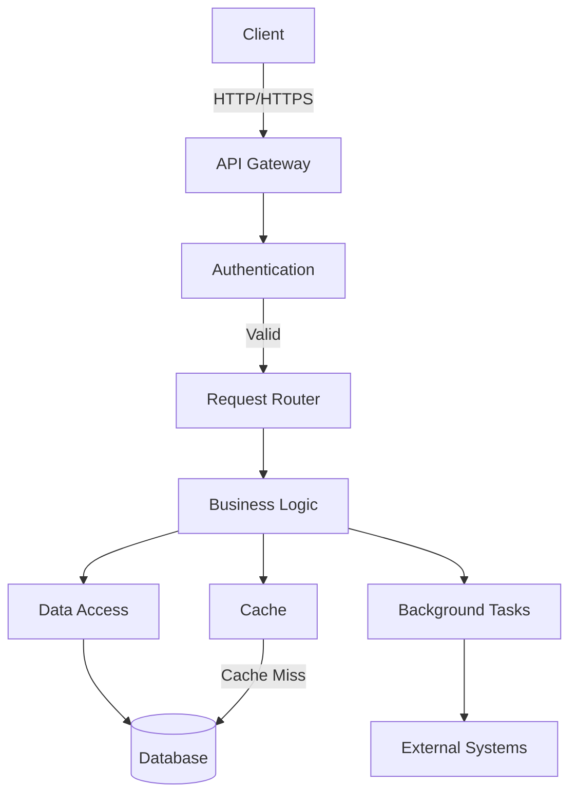

# Smooth Core Architecture

## Overview

Smooth Core is built with a modular, extensible architecture designed for high performance and reliability in manufacturing environments. This document provides an overview of the system's architecture and key components.

## System Components

### 1. API Layer
- **FastAPI-based REST API** - High-performance API framework with automatic OpenAPI documentation
- **Authentication Middleware** - Handles user sessions and API key validation
- **Request Validation** - Pydantic models for input validation and serialization
- **Rate Limiting** - Protects against abuse and ensures fair usage

### 2. Business Logic
- **Service Layer** - Implements core business logic and workflows
- **Permission System** - Fine-grained access control with roles and scopes
- **Change Detection** - Tracks and notifies about data changes
- **Background Tasks** - Handles long-running operations asynchronously

### 3. Data Layer
- **SQLAlchemy ORM** - Database abstraction layer
- **Alembic Migrations** - Database schema versioning and migrations
- **Connection Pooling** - Efficient database connection management
- **Caching Layer** - Redis-based caching for improved performance

### 4. Integration Layer (planned)
- **Webhook System** - Event-driven notifications for external systems
- **Import/Export** - Supports standard formats (JSON, CSV, XML)
- **Plugin System** - Extensible architecture for custom integrations

## Data Flow

## Security Model

- **Authentication**: JWT-based authentication with refresh tokens
- **Authorization**: Role-based access control (RBAC) with fine-grained permissions
- **Data Protection**: Encryption at rest and in transit (TLS 1.2+)
- **Audit Logging**: Comprehensive logging of all sensitive operations
- **Rate Limiting**: Protection against brute force and DDoS attacks

## Performance Considerations

- **Caching**: Multi-level caching strategy
- **Connection Pooling**: Efficient database connection management
- **Bulk Operations**: Optimized for batch processing
- **Asynchronous Processing**: Non-blocking I/O operations

## Deployment Options

- **Docker** - Containerized deployment
- **Kubernetes** - Orchestrated deployment for high availability
- **Serverless** - Function-as-a-Service deployment options
- **On-Premises** - Traditional server deployment

## Monitoring and Observability

- **Logging**: Structured logging with correlation IDs
- **Metrics**: Prometheus metrics endpoint
- **Tracing**: Distributed tracing with OpenTelemetry
- **Health Checks**: Liveness and readiness probes

## Dependencies

- Python 3.9+
- SQLite (development) / PostgreSQL (production)
- Redis (for caching and background tasks)
- Optional: Prometheus, Grafana (for monitoring)
