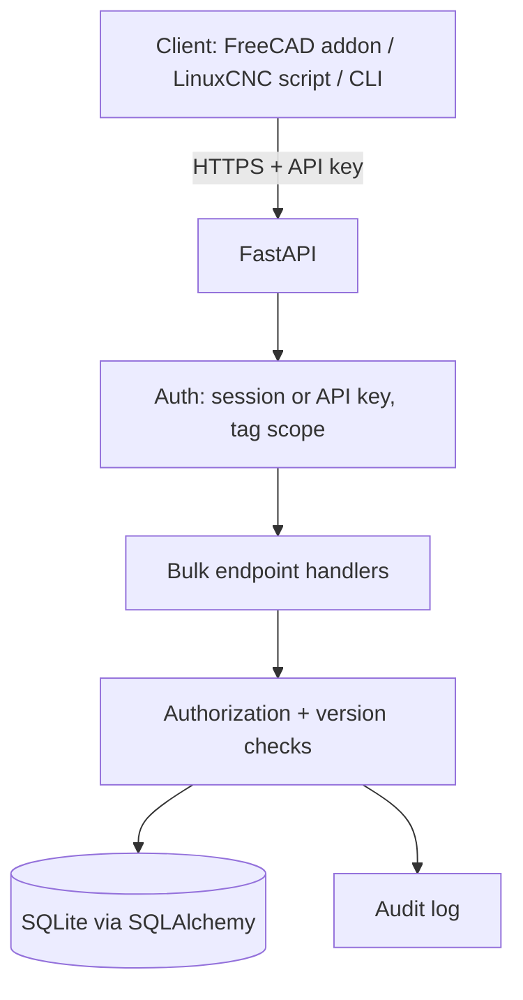

# Smooth Core Architecture

## Overview

Smooth Core is a REST API and database for tool data synchronization. This document
describes the system as it exists in the code. Planned capabilities live in
[ROADMAP.md](../ROADMAP.md), not here.

## System Components

### 1. API Layer
- **FastAPI-based REST API** with automatic OpenAPI documentation
- **Authentication middleware** — session cookies (web/CLI login) and user-created API keys
- **Request validation** — Pydantic models for input validation and serialization
- **Bulk-first endpoints** — create/update/delete many entities per request, with
  partial-success semantics (per-item errors, the rest commit)

### 2. Business Logic
- **Authorization at the function level** — role checks (user/admin/manufacturer) plus
  tag-scoped API keys (a key can be restricted to entities carrying specific tags)
- **Optimistic locking** — every entity carries an integer `version`; writes with a stale
  version are rejected per-item
- **Change detection** — query changed entities since a version or timestamp
  (`/api/v1/changes/...`), so clients sync deltas
- **Audit log** — immutable record of who changed what, when (operation, entity, before/after)
- **Backup/restore** — atomic JSON export/import, per-tenant; tool sets additionally keep
  version history with restore and compare endpoints

### 3. Data Layer
- **SQLAlchemy ORM** with **SQLite** as the supported database
- **Schema creation** on startup via `create_all` (missing tables only), followed by
  the **migration spine** (`smooth/migrations/`) which evolves existing tables — a small
  in-repo, forward-only runner (no Alembic) with a `schema_migrations` ledger. See
  [MIGRATIONS.md](MIGRATIONS.md).
- JSON columns for tool geometry, offsets, and metadata

### 4. Structured Logging
- JSON-structured logs for operations and errors
- Separate immutable audit trail (see above) queryable via the API

## Data Flow

```mermaid
graph TD
    A[Client: FreeCAD addon / LinuxCNC script / CLI] -->|HTTPS + API key| B[FastAPI]
    B --> C[Auth: session or API key, tag scope]
    C --> D[Bulk endpoint handlers]
    D --> E[Authorization + version checks]
    E --> F[(SQLite via SQLAlchemy)]
    E --> G[Audit log]
```

## Security Model

- **Authentication**: session cookies for interactive use; API keys for machines/scripts
- **Authorization**: role-based access control plus tag-scoped API keys
- **Tenant isolation**: all queries filtered by the owning user account
- **Audit logging**: all data changes recorded immutably
- **Transport security**: run behind TLS (reverse proxy) in any networked deployment —
  the server itself does not terminate TLS

Not yet implemented (see roadmap): rate limiting, webhook signing, encryption at rest.

## Deployment

- **uvicorn** ASGI server; a `Dockerfile` is provided
- SQLite database file on local disk — back it up like any other file, or use the
  backup API
- Single-process; no external services (no Redis, no message broker) required

## Dependencies

- Python 3.11+
- SQLite
- FastAPI, SQLAlchemy, Pydantic (see `pyproject.toml`)
