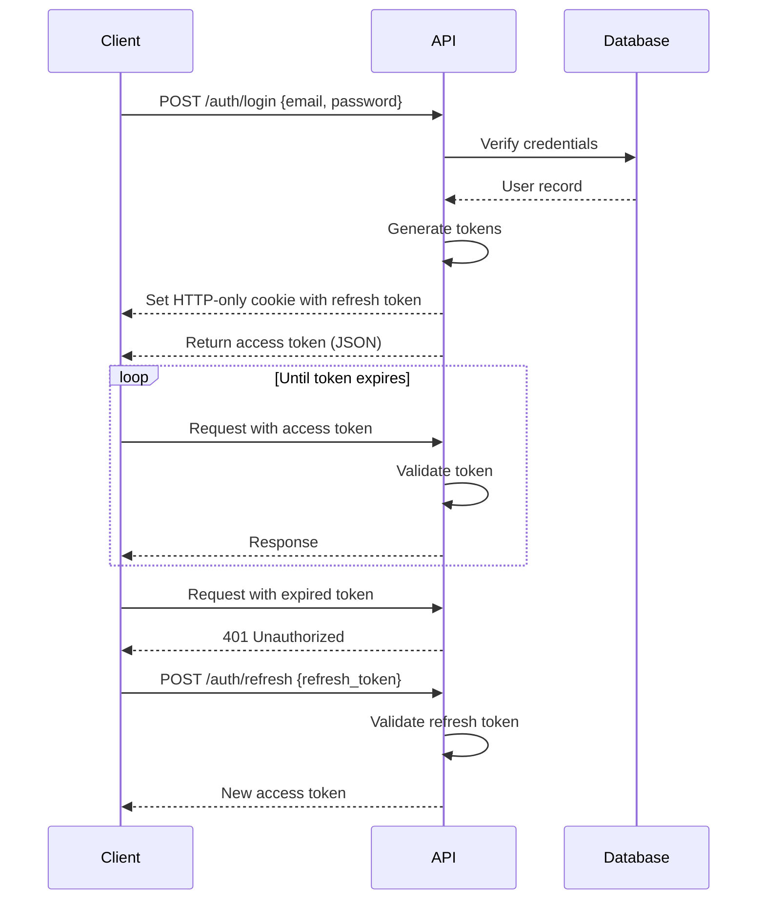

# Authentication and Authorization

This document outlines the authentication and authorization mechanisms in Smooth Core.

## Authentication Methods

### 1. User Authentication

#### Email/Password
- Standard email and password authentication
- Password hashed using Argon2
- Session-based with secure, HTTP-only cookies
- Configurable session duration (default: 24 hours)

#### OAuth 2.0 (Planned)
- Support for Google, GitHub, and Microsoft accounts
- JWT-based stateless authentication
- Automatic account linking

### 2. API Key Authentication
- Scoped API keys for programmatic access
- Key rotation support
- Last used tracking
- Revocation capability

## Authorization

### Role-Based Access Control (RBAC)

#### User Roles
1. **Admin**
   - Full system access
   - User management
   - System configuration

2. **Manager**
   - Create/read/update tool data
   - Manage tool assignments
   - View audit logs

3. **Operator**
   - View tool data
   - Record tool usage
   - Limited write access

4. **Viewer**
   - Read-only access
   - No modifications allowed

### Scopes

API keys can be scoped to specific operations:

```yaml
scopes:
  - tools:read
  - tools:write
  - presets:read
  - presets:write
  - admin:users
  - admin:system
```

## Token Management

### JWT Tokens
- Short-lived access tokens (15 minutes)
- Long-lived refresh tokens (7 days)
- Token rotation
- Automatic token revocation on password change

### API Keys
- Generated per application/user
- Can be revoked at any time
- Support for expiration dates
- Last used tracking

## Security Features

### Rate Limiting
- Configurable rate limits
- IP-based and user-based limiting
- Separate limits for authenticated and unauthenticated requests

### Security Headers
- Strict-Transport-Security
- X-Content-Type-Options
- X-Frame-Options
- Content-Security-Policy

### Password Policies
- Minimum length: 12 characters
- Requires uppercase, lowercase, numbers, and special characters
- Password history (last 5 passwords)
- Account lockout after failed attempts

## Implementation Details

### Authentication Flow



### Token Structure

**Access Token (JWT)**
```json
{
  "sub": "user123",
  "email": "user@example.com",
  "roles": ["operator", "manager"],
  "scopes": ["tools:read", "tools:write"],
  "iat": 1625097600,
  "exp": 1625098500
}
```

**Refresh Token**
- Stored in HTTP-only, secure, same-site cookie
- Randomly generated string
- Mapped to user session in database

## Best Practices

1. Always use HTTPS
2. Store refresh tokens securely (HTTP-only cookies)
3. Implement token rotation
4. Set appropriate token expiration times
5. Regularly rotate API keys
6. Monitor for suspicious activity
7. Log authentication events

## Troubleshooting

### Common Issues
1. **Invalid Token**
   - Check token expiration
   - Verify token signature
   - Ensure proper token format

2. **Access Denied**
   - Verify user role has required permissions
   - Check API key scopes
   - Confirm resource ownership

3. **Rate Limited**
   - Reduce request frequency
   - Implement request queuing
   - Contact support for limit increases
