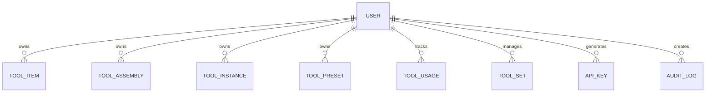

# Data Model

This document describes the core data model of Smooth Core, including entity relationships and field definitions.

## Core Entities

### User
Represents a user account in the system.

### ToolItem
Catalog items representing tool types and specifications.

**Fields:**
- `id`: UUID
- `name`: String (required)
- `description`: String
- `manufacturer`: String
- `part_number`: String
- `tool_type`: Enum (DRILL, END_MILL, etc.)
- `geometry`: JSON (tool-specific geometry data)
- `tags`: Array of strings for categorization
- `created_at`: DateTime
- `updated_at`: DateTime
- `version`: Integer (for optimistic locking)

### ToolAssembly
Represents a combination of a tool holder and cutting tool.

**Fields:**
- `id`: UUID
- `name`: String (required)
- `description`: String
- `holder_id`: ForeignKey to ToolItem
- `cutter_id`: ForeignKey to ToolItem
- `assembly_data`: JSON (assembly-specific data)
- `tags`: Array of strings
- `created_at`: DateTime
- `updated_at`: DateTime
- `version`: Integer

### ToolInstance
Physical tool with unique identification and measurements.

**Fields:**
- `id`: UUID
- `tool_item_id`: ForeignKey to ToolItem (optional)
- `tool_assembly_id`: ForeignKey to ToolAssembly (optional)
- `serial_number`: String (required, unique)
- `status`: Enum (AVAILABLE, IN_USE, MAINTENANCE, RETIRED)
- `measurements`: JSON (actual measured values)
- `purchase_date`: Date
- `last_calibration`: DateTime
- `calibration_due`: Date
- `tags`: Array of strings
- `created_at`: DateTime
- `updated_at`: DateTime
- `version`: Integer

### ToolPreset
Machine-specific tool setup and parameters.

**Fields:**
- `id`: UUID
- `name`: String (required)
- `description`: String
- `tool_instance_id`: ForeignKey to ToolInstance
- `machine_id`: String (reference to machine)
- `parameters`: JSON (machine-specific parameters)
- `is_default`: Boolean
- `tags`: Array of strings
- `created_at`: DateTime
- `updated_at`: DateTime
- `version`: Integer

### ToolUsage
Tracks tool usage and wear.

**Fields:**
- `id`: UUID
- `tool_instance_id`: ForeignKey to ToolInstance
- `start_time`: DateTime
- `end_time`: DateTime (nullable)
- `machine_id`: String
- `program_name`: String
- `operator`: String
- `usage_metrics`: JSON (runtime, cycles, etc.)
- `wear_measurements`: JSON (before/after measurements)
- `notes`: Text
- `created_at`: DateTime

### ToolSet
Collection of tools for a specific purpose (e.g., job, machine).

**Fields:**
- `id`: UUID
- `name`: String (required)
- `description`: String
- `is_global`: Boolean
- `tool_instances`: ManyToMany to ToolInstance
- `tool_presets`: ManyToMany to ToolPreset
- `tags`: Array of strings
- `created_at`: DateTime
- `updated_at`: DateTime
- `version`: Integer

## Relationships

- A `User` can own multiple `ToolItem`, `ToolAssembly`, `ToolInstance`, and `ToolPreset`
- A `ToolAssembly` consists of one or more `ToolItem`
- A `ToolInstance` can be associated with a `ToolItem` and/or `ToolAssembly`
- A `ToolPreset` is associated with a specific `ToolInstance`
- `ToolUsage` tracks the lifecycle of a `ToolInstance`
- `ToolSet` groups multiple `ToolInstance` and `ToolPreset`

## Versioning

All core entities support versioning for optimistic locking and history tracking. Each update increments the version number, and conflicts are detected when a stale version is updated.

## Indexes

Key indexes are created on:
- `User.email` (unique)
- `ToolItem.part_number`
- `ToolInstance.serial_number` (unique)
- `ToolPreset.(tool_instance_id, machine_id)`
- `ToolUsage.tool_instance_id`
- All foreign keys

## Data Validation

- All string fields have appropriate length limits
- Enumerated fields are strictly validated
- JSON fields are validated against schemas
- Required fields are enforced at the database level
- Unique constraints are enforced where appropriate
